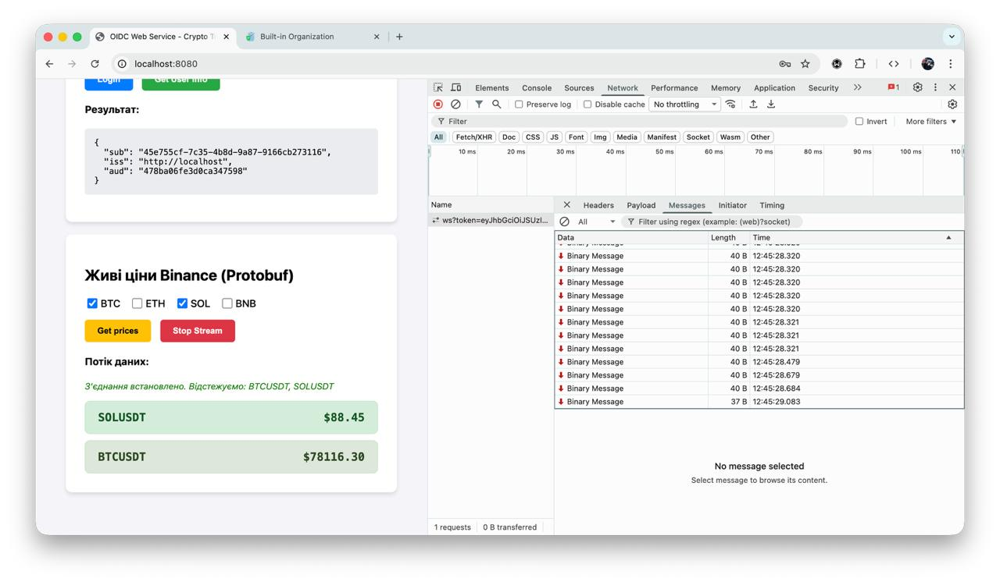
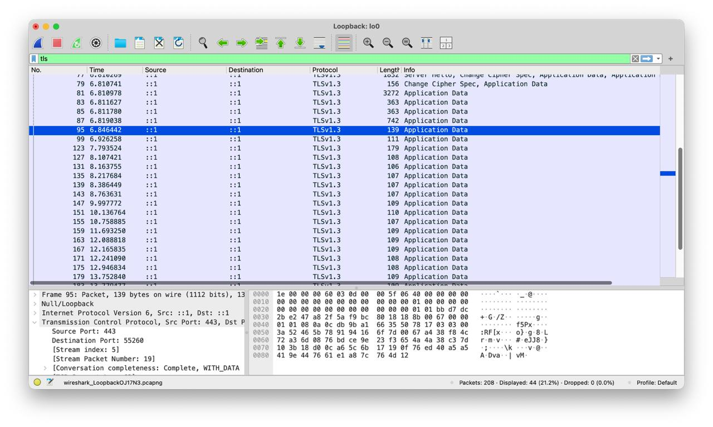
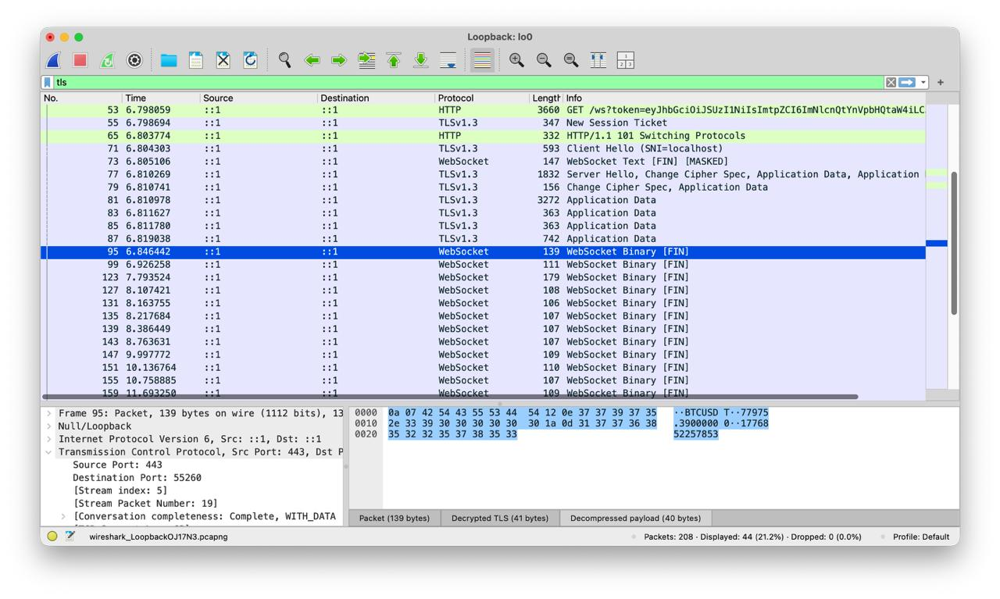

# Proof of Concept для стрімінгу фінансових даних

## Гаврилюк Данило

-----
## Стек технологій

  * **Бекенд:** Python 3.12, FastAPI, Uvicorn, Websockets, HTTPX, Asyncio
  * **Джерело даних:** Binance WebSocket API
  * **Серіалізація:** Protocol Buffers (proto3)
  * **IAM-платформа:** Casdoor (OIDC)
  * **Мережа та Безпека:** Nginx (Reverse Proxy), TLS/SSL (mkcert)

-----

## Архітектура рішення та логіка взаємодії

Реалізовано комплексну архітектуру, 
яка поєднує безпеку (OIDC) із високою продуктивністю передачі даних 
реального часу (WebSockets + Protobuf).

### 1\. **Мережевий рівень (WebSockets та Безпека)**

Оскільки WebSockets встановлюють постійне з'єднання, стандартний 
механізм передачі HTTP-кукі часто блокується сучасними браузерами з 
міркувань безпеки (CORS/Cross-Origin обмеження). Тому процес підключення 
реалізовано наступним чином:

**Етап 1:** Отримання токена
Користувач проходить стандартний OIDC Authorization Code Flow
та отримує `access_token`, який зберігається в Cookie.

**Етап 2:** Ініціалізація WebSocket (Handshake)
Фронтенд зчитує токен з Cookie та формує захищений запит на підключення, 
передаючи токен у параметрах URL: `wss://localhost/ws?token=<access_token>`. 
Це гарантує, що бекенд отримає ідентифікатор користувача ще до етапу 
прийняття з'єднання.

**Етап 3:** Валідація та Підключення
Бекенд (FastAPI) отримує токен з `query_params`, виконує прямий запит 
до Casdoor (`/api/userinfo`) для його валідації. Лише у випадку 
успішної відповіді (200 OK) сервер приймає WebSocket-з'єднання. 
Якщо токен недійсний або відсутній, з'єднання миттєво розривається 
з кодом `1008 Policy Violation`.

-----

### 2\. Програмна реалізація (FastAPI)

Логіка бекенду базується на асинхронному програмуванні та розділена 
на ключові компоненти:

#### Фонове завдання `binance_stream()`:

Використовуючи менеджер контексту `lifespan` у FastAPI, при старті 
сервера запускається фонове завдання. Воно встановлює з'єднання з 
публічним API Binance (`wss://stream.binance.com`), безперервно 
отримує JSON-дані про ціни криптовалют (`BTC, ETH, SOL, тощо`) і передає 
їх у `ConnectionManager`.

#### `ConnectionManager`:

Клас, що відповідає за маршрутизацію повідомлень. Він зберігає 
інформацію про те, який саме клієнт (WebSocket) підписаний на яку 
валютну пару. Замість того, щоб пересилати сирий JSON від Binance, 
менеджер виконує **серіалізацію даних у Protobuf**, перетворюючи їх 
на компактний бінарний масив перед відправкою підписникам.

#### Ендпоінт `@app.websocket("/ws")`:

Обслуговує клієнтські підключення. Після валідації токена він переходить
у режим очікування (слухає клієнта). При отриманні 
JSON-команди `{"action": "subscribe", "symbol": "BTCUSDT"}`, 
він додає клієнта до відповідної "кімнати" в `ConnectionManager`.

-----

### 3\. Бінарна серіалізація (Protocol Buffers)

Для оптимізації мережевого трафіку було використано Protobuf від Google.
Структура повідомлення описана у файлі `message.proto`:

```protobuf
syntax = "proto3";
message PriceUpdate {
    string symbol = 1;
    string price = 2;
    string timestamp = 3;
}
```

**На бекенді:** Дані пакуються у бінарний рядок за допомогою 
згенерованого класу `message_pb2.py` (`update.SerializeToString()`). 
Це зменшує розмір корисного навантаження порівняно з JSON та пришвидшує 
передачу.

**На фронтенді:** За допомогою бібліотеки `protobuf.js` клієнт динамічно
завантажує `message.proto`, розшифровує отриманий 
`ArrayBuffer` (`PriceUpdateMessage.decode(buffer)`) та відображає дані в UI.

-----

### 4\. Забезпечення безпеки (TLS та Nginx)

Як і в ЛР №3, для захисту комунікації використовується Nginx у ролі 
зворотного проксі.

  * Фронтенд звертається до бекенду за адресою `wss://localhost/ws`.
  * Nginx перехоплює цей трафік на порту 443, розшифровує його (використовуючи локальні сертифікати `mkcert`) і виконує **TLS Termination**.
  * Далі трафік передається локально (всередині Docker-мережі) до FastAPI як звичайний `ws://`. Це приховує бізнес-логіку та захищає передачу токенів у URL від перехоплення.

-----

### 📊 Аналіз процесів (Developer Console та Wireshark)

### **Developer Console:**


Скріншот `Network -> WS -> Headers`: Демонструє процес HTTP Handshake та 
отримання статусу `101 Switching Protocols`. У URL чітко видно передачу 
JWT-токена.


Скріншот `Network -> WS -> Messages`: Демонструє потік бінарних 
повідомлень від сервера, що підтверджує успішне використання Protobuf.

### Wireshark: Аналіз TLS та розшифрування трафіку

Для аналізу захищеного з'єднання було використано інструмент Wireshark 
на інтерфейсі Loopback із застосуванням фільтр `tls`. Щоб довести факт 
бінарної передачі даних, було експортовано сесійні ключі браузера через 
змінну `SSLKEYLOGFILE`.

1.  **Зашифрований трафік (Application Data):** Без підключення сесійних 
ключів весь трафік до Nginx виглядає як зашифровані пакети 
`Application Data` протоколу TLSv1.3. Це підтверджує, що зовнішній 
канал зв'язку надійно захищений від прослуховування.


2. **Розшифрований WebSocket-трафік:** Після інтеграції `sslkeys.log` у 
Wireshark, зашифровані пакети успішно дешифруються.


  * Пакет **WebSocket Text [MASKED]** демонструє команду підписки, 
яку фронтенд відправляє на сервер (браузери завжди маскують вихідні 
текстові кадри).
  * Пакети **WebSocket Binary** демонструють безперервний потік даних 
від сервера.
  * У вікні **Decrypted TLS / Decompressed payload** чітко видно 
розшифровані фрагменти тексту (наприклад, `BTCUSDT` та цифри цін), 
що доводить успішне декодування Protobuf-структури з бінарного потоку.

-----

## Висновок

Під час виконання даної роботи я розширив свої знання з 
побудови безпечних вебзастосунків, об'єднавши концепції IAM-аутентифікації 
з технологіями реального часу.

Найбільшим викликом та, водночас, найкориснішим досвідом стало розуміння 
того, як інтегрувати OIDC із WebSockets. Я на практиці переконався, що 
стандартні підходи з HTTP Headers або Cookies не завжди працюють для 
постійних з'єднань, і навчився безпечно передавати токени через URL з 
обов'язковою перевіркою на рівні бекенду до прийняття з'єднання.

Окрім цього, я здобув практичний досвід роботи з бінарною серіалізацією. 
Використання Protocol Buffers замість звичного JSON дозволило мені 
зрозуміти, як великі платформи оптимізують мережевий трафік. Я навчився 
компілювати `.proto` файли та працювати з бінарними буферами 
(`ArrayBuffer`) на стороні JavaScript.

Також я поглибив свої навички мережевого аналізу у Wireshark. Налаштування 
експорту сесійних ключів браузера (`SSLKEYLOGFILE`) для розшифрування 
TLSv1.3 "на льоту" дозволило мені зазирнути всередину зашифрованого 
тунелю і наочно побачити різницю між текстовими (Masked) та 
бінарними WebSocket-фреймами.
